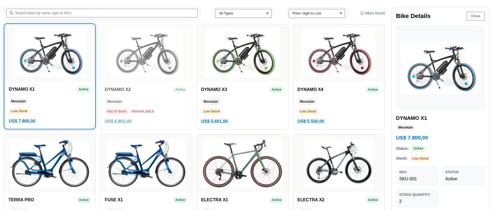
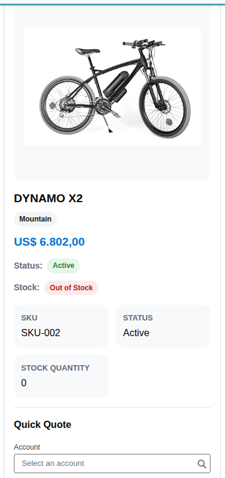
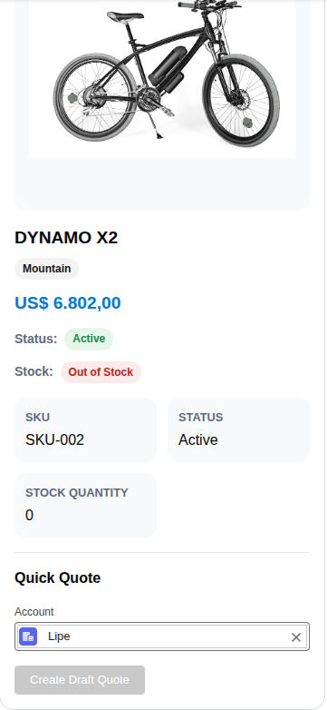
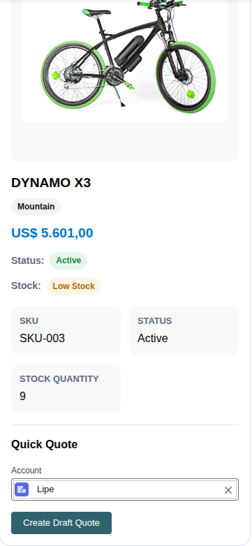
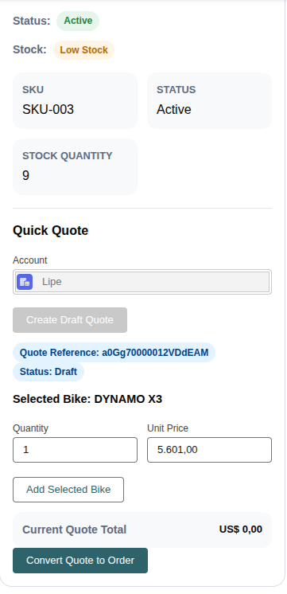
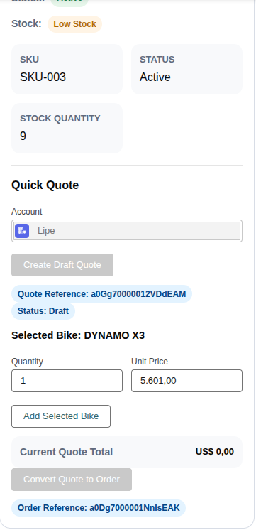

# 🚴 Bike B2B Sales App

> A Salesforce portfolio project simulating a complete **B2B product catalog and sales workflow** — from quote creation to order conversion — built with Apex, SOQL, and Lightning Web Components (LWC).

🇧🇷 Português: [README.pt.md](README.pt.md)


---

## 🧠 Project Overview

The **Bike B2B Sales App** is a Salesforce application that simulates a complete B2B sales process — from browsing a product catalog to converting a quote into an order.

Built to demonstrate real-world Salesforce development skills, this project covers:

- **Backend business logic** using Apex service layers and thin triggers
- **Frontend UI** using Lightning Web Components
- **Scalable architecture** following Salesforce development best practices
- **End-to-end sales flow**: product browsing → quote creation → order conversion

> **Version 3** introduces a fully integrated sales workflow, including stock validation, Quote Builder, and Quote-to-Order conversion directly from the bike catalog.

---

## 💼 Business Scenario

A bicycle distributor needs a Salesforce-based solution to manage their B2B sales operations.

Sales representatives must be able to:

- Browse an internal product catalog with real-time stock visibility
- Create draft quotes on behalf of client accounts
- Add products, define quantities, and apply pricing
- Convert approved quotes into orders without leaving the platform

This project simulates that workflow inside a Salesforce org, replacing manual spreadsheet-based processes with a structured, automated CRM solution.

---

## ✨ Features

### 🚴 Bike Catalog

- Responsive product grid with bike listings
- Search and filtering capabilities
- Bike detail panel with full product information
- Real-time stock status badges

### 📦 Stock Management

| Status              | Condition                | Behavior               |
| ------------------- | ------------------------ | ---------------------- |
| 🟢 **In Stock**     | Quantity above threshold | Quote creation allowed |
| 🟡 **Low Stock**    | Quantity below threshold | Warning displayed      |
| 🔴 **Out of Stock** | Quantity = 0             | Quote creation blocked |

Stock statuses are automatically calculated and displayed as visual indicators in the catalog UI.

### 💰 Quote Builder

Create and manage draft quotes directly from the catalog:

- Select a **client Account**
- Add one or more bikes to the quote
- Define quantity per item
- Unit price pre-filled from product data
- Automatic **subtotal** calculation per line item
- Automatic **quote total** recalculation

**Built-in validations:**

- Prevents quoting out-of-stock products
- Quantity and price field validation
- Toast notifications for success and error feedback

### 🔄 Quote-to-Order Conversion _(V3)_

- Convert a finalized quote into a **Bike Order** in one action
- Order items automatically generated from quote line items
- Stock availability re-validated at conversion time
- Maintains traceability between quote and order records

---

## ⚙️ Tech Stack

| Technology                              | Usage                                           |
| --------------------------------------- | ----------------------------------------------- |
| **Apex**                                | Backend business logic, service layer, triggers |
| **SOQL**                                | Database queries via selector classes           |
| **Lightning Web Components (LWC)**      | Frontend UI components                          |
| **JavaScript**                          | LWC component logic                             |
| **Salesforce DX (SFDX)**                | Project structure and deployment                |
| **Git**                                 | Version control                                 |
| **VS Code + Salesforce Extension Pack** | Development environment                         |

---

## 🏗 Architecture Overview

The application follows a **layered architecture** pattern, separating concerns across distinct layers:

```
┌─────────────────────────────────┐
│    Lightning Web Components     │  ← UI Layer (bikeCatalog, bikeCard, quoteBuilder)
└────────────────┬────────────────┘
                 │ @wire / imperative Apex calls
┌────────────────▼────────────────┐
│        Apex Controllers         │  ← Thin controllers exposing methods to LWC
└────────────────┬────────────────┘
                 │
┌────────────────▼────────────────┐
│         Service Layer           │  ← Business logic (BikeService, BikeQuoteService, BikeOrderService)
└────────────────┬────────────────┘
                 │
┌────────────────▼────────────────┐
│      Selector Layer (SOQL)      │  ← Centralized queries (BikeSelector)
└────────────────┬────────────────┘
                 │
┌────────────────▼────────────────┐
│         Custom Objects          │  ← Salesforce data model
└─────────────────────────────────┘
```

**Key architectural decisions:**

- **Thin triggers** — all business logic delegated to service classes
- **Selector classes** — all SOQL queries centralized and reusable
- **Service layer** — encapsulates domain logic, independent of UI

---

## 🧩 Data Model

### Custom Objects

| Object               | Description                                |
| -------------------- | ------------------------------------------ |
| `Bike__c`            | Product catalog — bikes available for sale |
| `Bike_Quote__c`      | Sales quote header linked to an Account    |
| `Bike_Quote_Item__c` | Individual line items within a quote       |
| `Bike_Order__c`      | Order generated from a confirmed quote     |
| `Bike_Order_Item__c` | Individual line items within an order      |

### Key Fields

| Field               | Object               | Type             | Purpose                     |
| ------------------- | -------------------- | ---------------- | --------------------------- |
| `Stock_Quantity__c` | `Bike__c`            | Number           | Current inventory level     |
| `Stock_Status__c`   | `Bike__c`            | Formula/Picklist | Availability indicator      |
| `Unit_Price__c`     | `Bike_Quote_Item__c` | Currency         | Price per unit              |
| `Quantity__c`       | `Bike_Quote_Item__c` | Number           | Requested quantity          |
| `Subtotal__c`       | `Bike_Quote_Item__c` | Currency         | Auto-calculated line total  |
| `Total_Amount__c`   | `Bike_Quote__c`      | Currency         | Auto-calculated quote total |
| `Account__c`        | `Bike_Quote__c`      | Lookup           | Client account reference    |

---

## 🖥 Lightning Web Components

| Component      | Responsibility                                   |
| -------------- | ------------------------------------------------ |
| `bikeCatalog`  | Main catalog grid — displays all available bikes |
| `bikeCard`     | Individual product card with stock badge         |
| `bikeDetails`  | Product detail panel with Quick Quote section    |
| `quoteBuilder` | Quote creation form with line item management    |

---

## 🚀 Installation / Setup

### Prerequisites

- Salesforce CLI (`sf`) installed
- VS Code with Salesforce Extension Pack
- Access to a Salesforce Developer Org or Scratch Org

### Steps

**1. Clone the repository**

```bash
git clone https://github.com/FelipeSEugenio/bike-b2b-sales-app.git
cd bike-b2b-sales-app
```

**2. Open in VS Code**

```bash
code .
```

**3. Authenticate with your Salesforce org**

```bash
sf org login web
```

**4. Deploy metadata to the org**

```bash
sf project deploy start
```

**5. Open the org in the browser**

```bash
sf org open
```

---

## 🧪 Running Tests

**Run Apex unit tests with code coverage:**

```bash
sf apex run test --code-coverage --result-format human
```

**Run LWC unit tests:**

```bash
npm run test:unit
```

---

## 📸 Screenshots

> Product catalog with stock status badges



> Quote builder with line items and total calculation







---

## 📈 Roadmap

Planned improvements for future versions:

- [ ] **Order fulfillment workflow** — track order status through fulfillment stages
- [ ] **Inventory reservation** — reserve stock when a quote is created
- [ ] **Account-based pricing tiers** — custom pricing per client segment
- [ ] **PDF quote generation** — export quotes as downloadable PDFs
- [ ] **Enhanced UI/UX** — improved filtering, sorting, and responsive design
- [ ] **Approval process** — quote approval workflow before conversion

---

## 👨‍💻 Author

**Felipe Siqueira Eugênio**
Salesforce Developer

`Apex` • `LWC` • `SOQL` • `CRM` • `Agentforce`

[](www.linkedin.com/in/felipe-de-siqueira-eugenio)
[](https://github.com/FelipeSEugenio)

---

> ⭐ This project was built as a Salesforce Developer portfolio demonstrating backend Apex development, LWC frontend, layered architecture, and end-to-end B2B sales workflow implementation.
