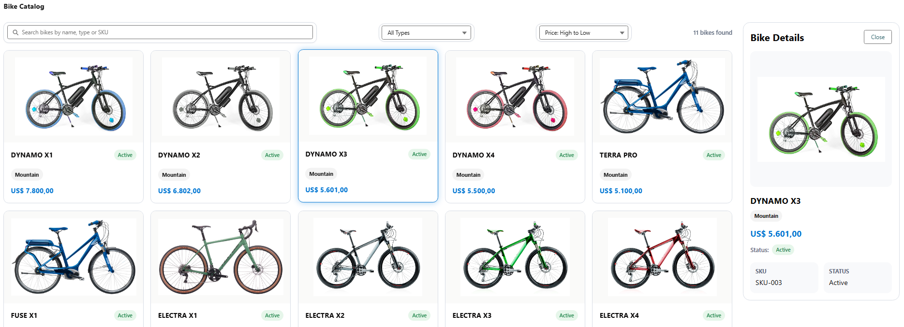
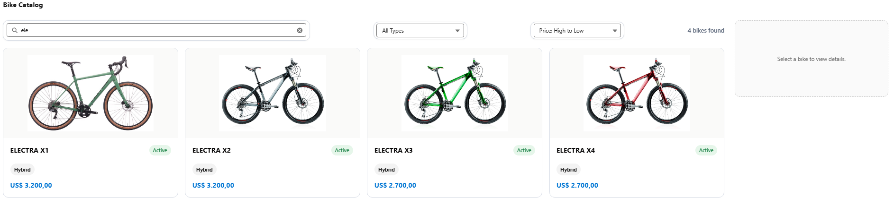

# Bike B2B Sales App

Bike B2B Sales App is a Salesforce portfolio project built to simulate a real B2B product catalog experience for bicycle sales.

The application allows users to browse bikes, search products, filter by type, sort results, and view detailed product information in a side panel.

This project was developed to strengthen practical skills in **Salesforce Development**, focusing on **Apex**, **SOQL**, and **Lightning Web Components (LWC)**.

---

## Project Goals

The main goal of this project is to build a professional portfolio application that demonstrates how a Salesforce Developer can create a product-driven experience with:

- custom objects
- Apex backend logic
- SOQL queries
- LWC frontend components
- state management
- incremental UI/UX improvements

This application was designed as a **V1 foundation**, with future plans for more advanced **B2B sales features** in V2.

---

## Tech Stack

- **Salesforce**
- **Apex**
- **SOQL**
- **Lightning Web Components (LWC)**

---

## Current Features (V1)

- Bike catalog grid
- Product detail side panel
- Search by **name**, **type**, and **SKU**
- Dynamic filter by bike type
- Sorting by:
  - Price: Low to High
  - Price: High to Low
  - Name: A to Z
- Selected bike visual highlight
- Visual product status badges
- Loading and empty states
- Responsive layout improvements

---

## Data Model

### Custom Object
- `Bike__c`

### Main Fields
- `Name`
- `SKU__c`
- `Price__c`
- `Bike_Type__c`
- `Status__c`
- `Image_URL_c__c`

---

## Apex Layer

### `BikeSelector`
This Apex class is responsible for querying bike data from Salesforce.

#### Methods
- `getActiveBikes(Integer limitSize)`
  - Returns active bikes for the catalog view
- `getById(Id bikeId)`
  - Returns the details of a selected bike

The Apex layer was kept simple and focused for V1, with room for future backend filtering and business rules in V2.

---

## Frontend Layer

### `bikeCatalog`
Main LWC component responsible for the catalog experience.

#### Responsibilities
- load bikes from Apex using `@wire`
- render product cards
- manage selected bike state
- apply search, type filtering, and sorting
- load bike details on selection
- display a side detail panel

---

## User Experience

The current version focuses on a clean and practical catalog flow:

1. Users can browse all available bikes
2. Search results update dynamically
3. Bikes can be filtered by type
4. Results can be sorted by price or name
5. Clicking a bike opens its details in a side panel
6. Selected bikes receive visual highlight
7. Product status is shown visually for better commercial context

---

## Screenshots




- catalog view
- filtered results
- selected bike detail panel

Example:

```md

